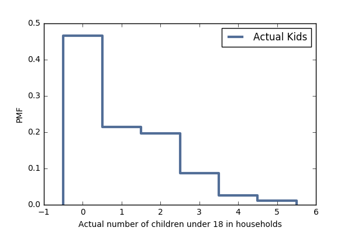

[Think Stats Chapter 3 Exercise 1](http://greenteapress.com/thinkstats2/html/thinkstats2004.html#toc31) (actual vs. biased)

>> 
Exercise 3.1 Something like the class size paradox appears if you survey children and ask how many children are in their family. Families with many children are more likely to appear in your sample, and families with no chil- dren have no chance to be in the sample.
Use the NSFG respondent variable NUMKDHH to construct the actual distribu- tion for the number of children under 18 in the household.
Now compute the biased distribution we would see if we surveyed the children and asked them how many children under 18 (including themselves) are in their household.
Plot the actual and biased distributions, and compute their means. As a starting place, you can use chap03ex.ipynb.
ff
### Solution

```python
# Import & exam the data
resp = nsfg.ReadFemResp()
resp.head()

# Load the variable
actual_kids = resp.numkdhh
actual_kids.head()

# Create a pmf for the number of children under 18 from variable numkdhh
pmf = thinkstats2.Pmf(actual_kids)
pmf

# Plot the actual distribution
thinkplot.Pmf(pmf, label = 'Actual Kids')
thinkplot.Config(xlabel='Actual number of children under 18 in households', ylabel='PMF')

import matplotlib
import matplotlib.pyplot as plt


plt.savefig('actual_distribution.png')

```



```python
# Plot the biased distribution
def BiasPmf(pmf, label):
    new_pmf = pmf.Copy(label=label)

    for x, p in pmf.Items():
        new_pmf.Mult(x, x)
        
    new_pmf.Normalize()
    return new_pmf
    
biased_pmf = BiasPmf(pmf, 'Bias Kids')

thinkplot.Pmf(biased_pmf, label = 'Biased Kids')
thinkplot.Config(xlabel='Biased number of children under 18 in households', ylabel='Biased PMF')

plt.savefig('biased_distribution.png')

# Plot the actual and biased distribution together
thinkplot.PrePlot(2)
thinkplot.Pmfs([pmf, biased_pmf])
thinkplot.Config(xlabel='number of children', ylabel='PMF')

plt.savefig('actual & biased_distribution.png')

# Calculate the mean
pmf_mean = pmf.Mean()
biased_pmf_mean = biased_pmf.Mean()
print (pmf_mean)
print (biased_pmf_mean)
