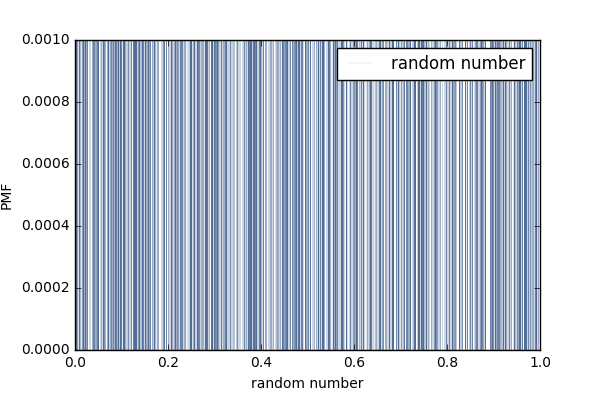
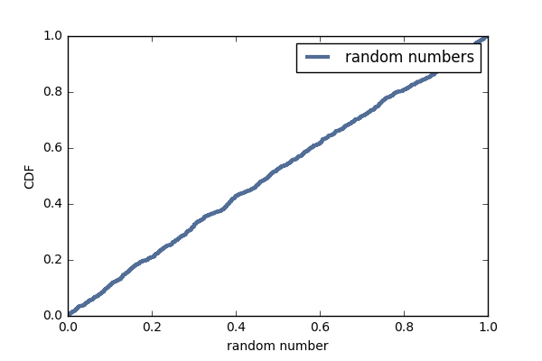

[Think Stats Chapter 4 Exercise 2](http://greenteapress.com/thinkstats2/html/thinkstats2005.html#toc41) (a random distribution)

>> Exercise 4.2 The numbers generated by random.random are supposed to be uniform between 0 and 1; that is, every value in the range should have the same probability. Generate 1000 numbers from random.random and plot their PMF and CDF. Is the distribution uniform?

### Solution

```python
# First, generate 1000 random numbers

import random

def random_gen(x):
    count = 0
    res = []
    while count < x:
        res.append(random.random())
        count += 1

    return res
    
q = random_gen(1000)

# Create the Pmf for these random numbers

q = thinkstats2.Pmf(q, label = 'thousand of random number')

# Plot the Pmf distribution

thinkplot.Pmf(q, label = 'random number', linewidth = 0.1)
thinkplot.config(xlabel = 'random number', ylabel = 'PMF')

import matplotlib
import matplotlib.pyplot as plt

plt.savefig('random number distribution')

```



#### Since there are a lot of discreate values, it is hard to observe the distribution from this graph. We can plot a CDF and see if CDF can provide us more insights to the distribution.

```python
# Create the CDF

cdf = thinkstats2.Cdf(q, label='random numbers')

# Plot the CDF

thinkplot.Cdf(cdf)
thinkplot.Config(xlabel='random number', ylabel='CDF')

plt.savefig('random number CDF')

```



#### From the CDF plot, we can tell that the distribution of the 1000 random numbers is uniform, as the CDF shows a smooth 45% degree straight line from 0 to 1.
